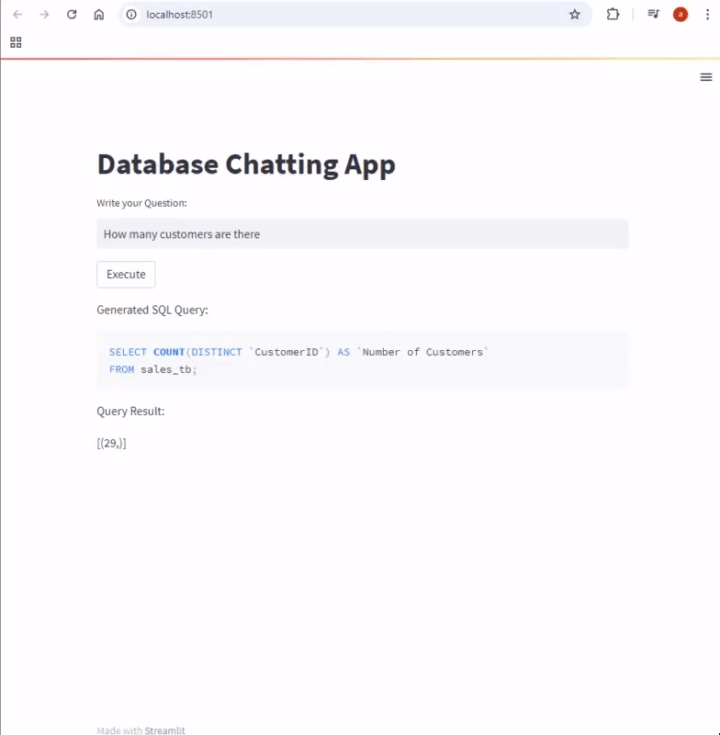

## Database Q/A app Using Streamlit, Gemini and LangChain
### Setup Environment: 
1. conda create -n env_db_qa python=3.10 
	  
2. conda activate env_db_qa
	  
3. Clone this repo

4. Install packages: pip install -r requirements.txt

5. Update your google api key and langchain api key

6. Install  and  workbench and create a database

7. Update the code with your database details


### Run
```bash
		streamlit run db_qa_app.py
```

## Output


