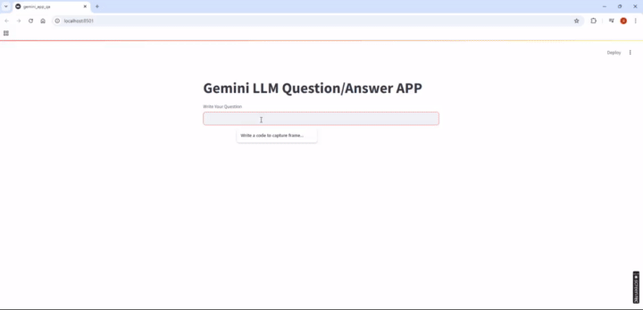

## Gemini Custom Application Using Streamlit and LangChain
### Setup Environment: 
1. conda create -n env_gemini python=3.10 
      
2. conda activate env_gemini
      
3. Clone this repo

4. Install packages: pip install -r requirements.txt

5. Update your google api key and langchain api key


### Run
```bash
        streamlit run gemini_custom_app.py
```

## Output

