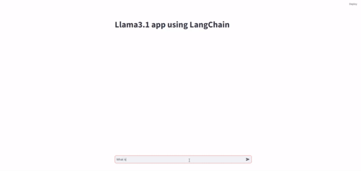

## Llama3.1 Custom Application Using Streamlit and LangChain
### Setup Environment: 
1. conda create -n env_Llama3.1 python=3.10 
      
2. conda activate env_Llama3.1
      
3. Clone this repo

4. Install packages: pip install -r requirements.txt

5. Install [Ollama](https://github.com/ollama/ollama)


### Run
```bash
ollama pull llama3.1
streamlit run Lliama3.1_custom_app.py
```

## Output

