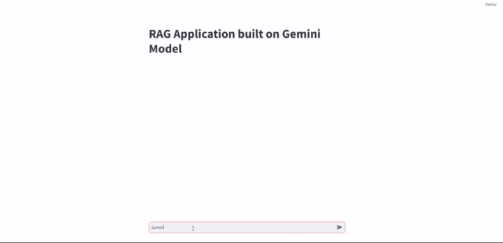

## RAG app Using Streamlit, Gemini and LangChain
### Setup Environment: 
1. conda create -n env_rag python=3.10 
	  
2. conda activate env_rag
	  
3. Clone this repo

4. Install packages: pip install -r requirements.txt

5. Update your google api key and langchain api key

6. This app performs q/a regarding the transformer research paper.


### Run
```bash
streamlit run RAG_using_gemini_app.py
```

## Output


